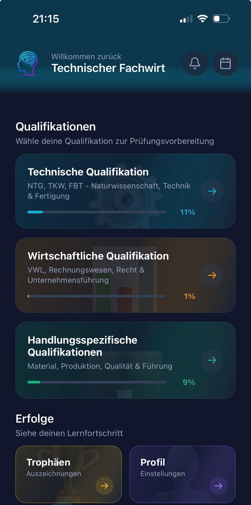
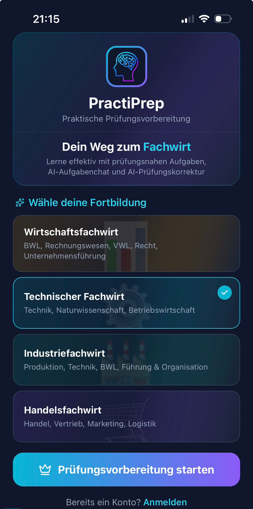
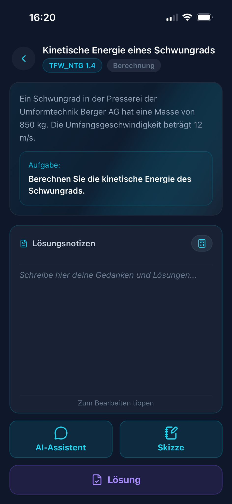
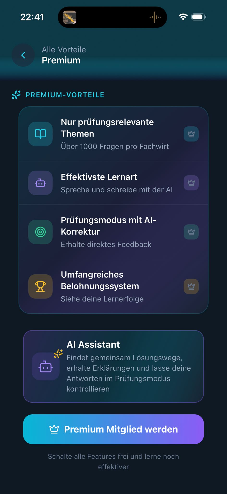
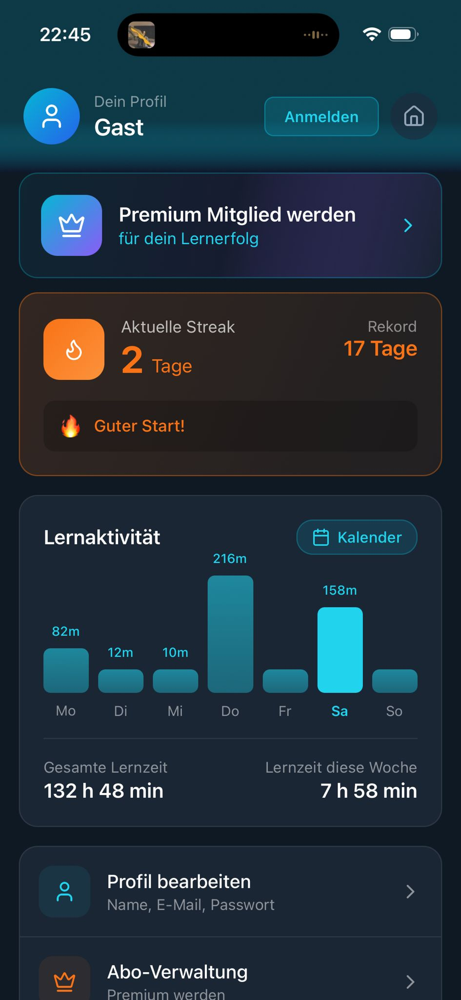
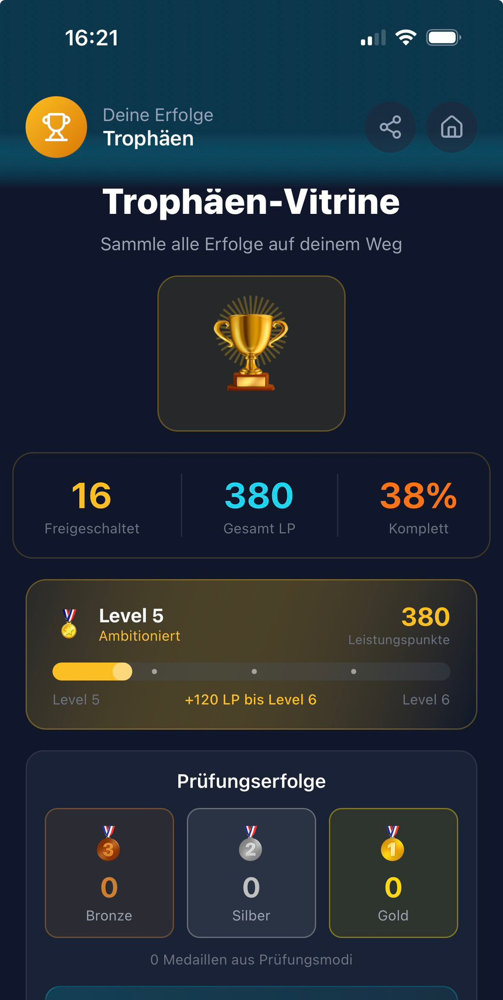

# PractiPrep Showcase

A public product showcase for **PractiPrep**, a mobile-first learning app for German IHK Fachwirt exam preparation.

PractiPrep combines structured question practice, exam-style learning modes, progress tracking, subscription-based premium access, and an AI learning assistant into one focused preparation experience.

> This repository is a showcase only. The production app source code, question database, backend logic, AI workflows, and payment implementation are proprietary and are not included.

## App Links

- App Store: [PractiPrep on the App Store](https://apps.apple.com/us/app/practiprep/id6757763222)
- Website: [practiprep.de](https://practiprep.de)

## Project Overview

PractiPrep is designed for learners who are preparing for demanding Fachwirt exams while balancing work, daily responsibilities, and limited study time.

The app focuses on turning exam preparation into a structured routine: learners select their Fachwirt track, work through relevant question categories, use different learning modes, review explanations, and track progress over time.

The product is built around practical exam preparation rather than generic flashcards. Its interface is optimized for repeated mobile use, quick orientation, and focused study sessions.

## Screenshot Preview

| Home | Learning Start | Exam Mode |
|---|---|---|
|  |  |  |

| Premium | Profile | Achievements |
|---|---|---|
|  |  |  |

## Key Features

- IHK Fachwirt preparation for multiple qualification tracks
- Structured navigation by exam-relevant learning areas
- Practice questions with explanations and progress state
- Exam-style mode for realistic preparation sessions
- AI learning assistant for explanations, reasoning support, and follow-up questions
- Voice input support for AI-assisted learning workflows
- Premium subscription access for advanced functionality
- Progress tracking, streaks, milestones, and achievement views
- Account-based sync for supported user data
- iPhone and iPad support as part of the product direction

## Supported Qualification Tracks

PractiPrep is designed around common German Fachwirt preparation paths, including:

- Technischer Fachwirt
- Wirtschaftsfachwirt
- Industriefachwirt
- Handelsfachwirt

The production app contains the actual learning structure and proprietary question content. This repository does not include the question database or answer material.

## Product Flow

1. Create an account or sign in.
2. Select the Fachwirt qualification path.
3. Choose a learning area or exam mode.
4. Work through structured practice content.
5. Use explanations and the AI assistant for deeper understanding.
6. Track learning progress through profile, statistics, and achievements.
7. Upgrade to Premium for the complete learning experience.

## Technology Overview

The production app is built with a modern React Native and Expo stack. This showcase intentionally only describes the architecture at a high level.

- React Native and Expo for cross-platform mobile development
- TypeScript for application logic
- Supabase for authentication, database-backed user features, and server-side functions
- RevenueCat for subscription entitlement management
- Apple App Store in-app purchases for iOS monetization
- Anthropic Claude API through protected backend functions for AI learning support
- Local persistence for device-level learning state

No production code, API keys, backend functions, database schema, or proprietary content are published here.

## Repository Scope

This repository exists to present the product publicly while protecting the core intellectual property of the app.

Included:

- Public product description
- Public screenshots and branding assets
- High-level architecture notes
- Privacy and data-handling overview
- App Store and website links

Not included:

- Production source code
- Real question database
- Real answer explanations
- AI system prompts
- Premium unlock logic
- Supabase Edge Functions
- StoreKit or RevenueCat implementation code
- Environment variables or secrets
- Internal product planning documents

## Documentation

- [Architecture Overview](docs/architecture.md)
- [Privacy Overview](docs/privacy-overview.md)
- [Public Repository Scope](docs/repository-scope.md)

## Design Direction

PractiPrep uses a focused dark interface with high-contrast cards, clear progress feedback, compact learning surfaces, and product-specific visual language. The design direction aims to feel serious, efficient, and professional rather than playful or generic.

The app is intended for adults preparing for career-relevant qualifications, so the interface prioritizes clarity, orientation, and repeated daily use.

## Legal Notice

PractiPrep, its learning content, UI implementation, backend workflows, AI configuration, and question database are proprietary.

This showcase repository is not an open-source release of the app.

## Author

Created by [Nico Ohm](https://github.com/Nico-Ohm) / NOQCode.